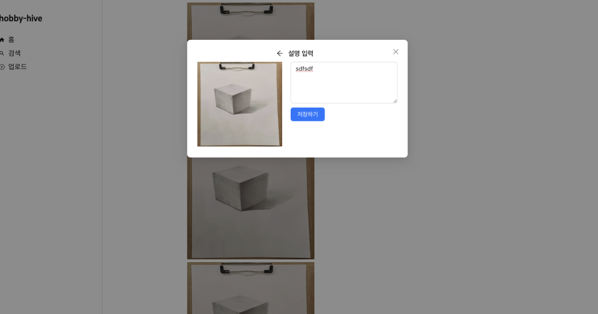
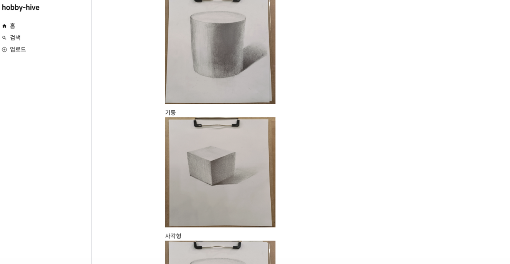

## 프로젝트 소개

나의 취미를 기록하고 공유하는 서비스

## 배포

https://hobby-hive-eight.vercel.app

### 이미지 및 텍스트 업로드



### 업로드 한 내용 확인



## 기술 스택

- Next.js, React, TypeScript
- React Query
- Scss, Ant Design
- jest, vercel, git actions
- Supabase

## 고민한 사항

1. 캐싱을 이용한 데이터 최적화

   이미지 데이터를 가져오는데 73ms 소요 되었는데 캐시후 2.4ms로 70ms를 단축하였습니다.
   staleTime을 gcTime 보다 짧게 설정하여 데이터가 stale 상태가 된 후에도 캐시에서 활용하여 불필요한 refetch를 줄였습니다.

2. ci/cd 파이프라인 구축

   git actions를 이용하여 jest 유닛 테스트를 자동화하여 안전하게 코드를 반영하고 vercel에 배포하는 cicd 파이프라인을 구축하였습니다.

3. 리소스 최적화로 LCP 1.6s 에서 0.8s 로 단축

- 폰트 사이즈 최적화

  기존 ttf파일이 88KB였다면, 웹폰트를 사용하여 woff, woff2파일로 각각 53KB, 40KB 크기로 최적화하였습니다.
  기존에 로컬에 해당 폰트가 있다면 다운로드없이 로컬 폰트를 사용하였습니다.
  제목에서 사용하는 알파벳만 subset으로 추출하여서 woff, woff2파일을 2KB까지 줄였습니다.

- 이미지 최적화

  기존 300KB가량의 파일을 width, height를 600, 800으로 설정, 퀄리티를 75%로 조정하여 사이즈를 최적화하였습니다.
  폰트 및 이미지를 최적화하여 LCP를 1.6s에서 0.8s로 단축하였습니다.

## 시작

```bash
npm run dev
```
